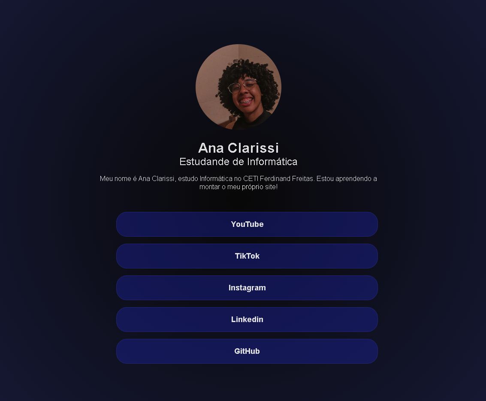

# 🌐 Site Pessoal — Ana Clarissi

Este é o meu **site pessoal**, desenvolvido como parte do meu aprendizado durante a  
**Formação Front-End by Fluency Future [Essentials]**, oferecida pela **Awari**.

O objetivo do projeto foi aplicar, na prática, os conceitos fundamentais de desenvolvimento Front-End, além de criar uma página que represente quem eu sou e minha trajetória na tecnologia.

---

## ✨ Sobre o projeto

O site funciona como um **link-in-bio / portfólio inicial**, reunindo:
- Uma breve apresentação pessoal  
- Links para minhas redes sociais (LinkedIn, GitHub, Instagram, TikTok e YouTube)  
- Um layout simples, moderno e responsivo
  
Este projeto representa meu **primeiro passo na construção da minha presença online como desenvolvedora**.

---

## 🖥️ Preview do site

---

## 🛠️ Tecnologias utilizadas

- **HTML5** — estrutura do site  
- **CSS3** — estilização e layout  
- Design responsivo  

---

## 🎓 Aprendizados

Com esse projeto, pude aprender e praticar:

- Estruturação correta de páginas HTML  
- Estilização com CSS  
- Organização de arquivos  
- Criação de um layout simples e funcional  
- Publicação de projetos no GitHub  

---

## 🚀 Status do projeto

✅ Concluído  
📌 Aberto para melhorias futuras, conforme meu aprendizado evoluir

---

## 🔗 Acesse o site

👉 <a href="https://anaclarissi.github.io/Front-end-Essencial/" target="_blank">https://anaclarissi.github.io/Front-end-Essencial/</a>

---

## 👩🏽‍💻 Autora

**Ana Clarissi**  
Estudante de Informática  
📚 Em constante aprendizado em desenvolvimento Front-End  

- GitHub: https://github.com/anaClarissi
- LinkedIn: https://www.linkedin.com/in/anaclarissi

---

## 🎓 Certificado

👉 [Ver certificado de conclusão](assets/certificado.png)

---

## 🤝 Agradecimentos

Agradeço à **Awari** e à **Fluency Future** pela formação e pelo incentivo ao aprendizado prático.
